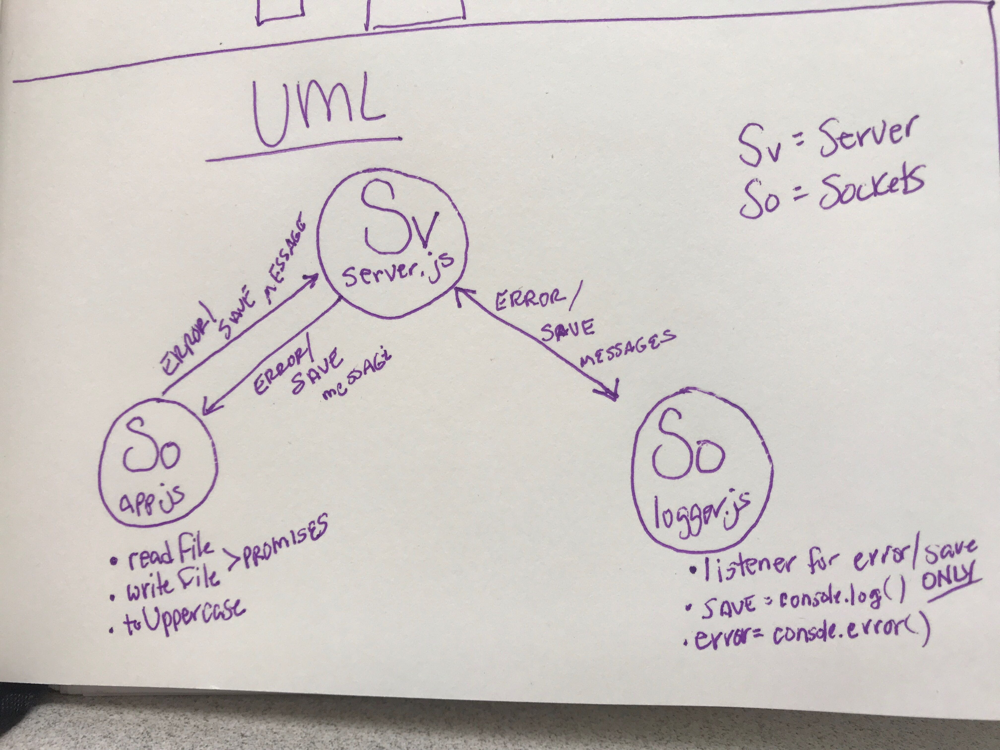

# lab-17
## TCP Server / Message Application

### Author: Chloie Parsons 

##  Links and Resources
* [Submission PR](https://github.com/chloieparsons-401-advanced-javascript/lab-17/pull/1)
* [Travis](https://www.travis-ci.com/chloieparsons-401-advanced-javascript/lab-17)


## Modules
* ```app.js``` 
  - Refactored to be modular, testible, and clean. This file contains read/write commands in promise form, not callbacks. As well, reading, writing, and uppercasing happen in one module. This file takes in information, reads it, and writes it out in an uppercase string. It connects to the running server using TCP and writes an error message or a save message to the socket in the instance of an error or successful save.

* ```logger.js```
  - Connects to the TCP server on PORT 3000 and listens for ```error``` and ```save``` events only. On ```save```, it does a console log message noting success and on ```error``` it does a console error with a message noting error.

* ```server.js```
  - Listens for connections on port 3000. Parses the text it recieves and broadcasts good ```events``` to all connected clients. (Listens, accepts, and re-emits ```events```.)

## Setup
### .env requirements
PORT - 3001

## Running the app
* ```node app.js```

## Tests
* ```npm test```
* ```npm test-watch```
* ```npm lint```

## UML
